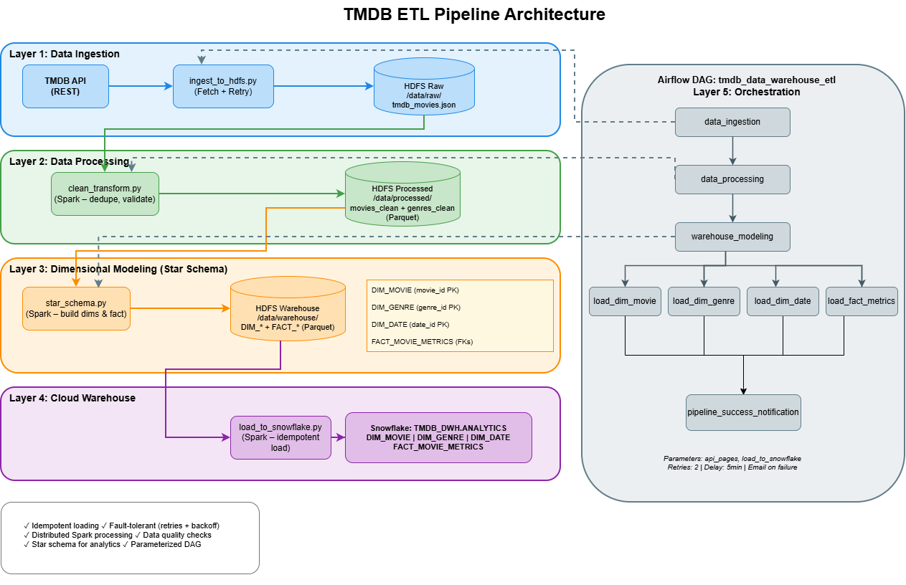
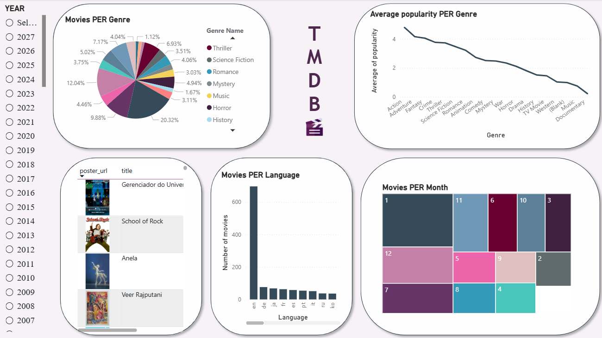
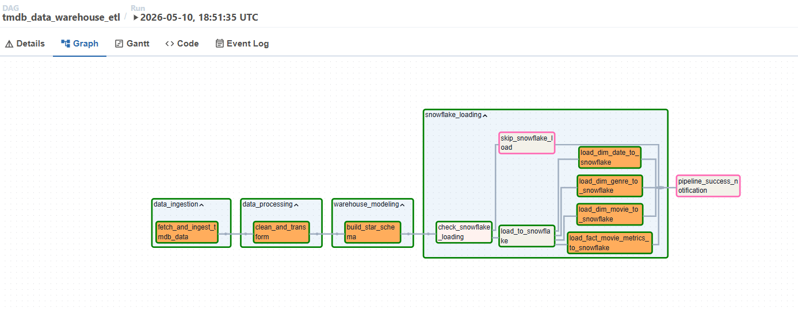

# 🎬 TMDB Data Engineering Pipeline

An end-to-end Big Data pipeline built using TMDB API, Apache Spark, Hadoop HDFS, Airflow, Snowflake, and Power BI.

The project automates the process of:
- Extracting movie data from TMDB API
- Storing raw data in HDFS
- Processing and transforming data with Spark
- Building a Star Schema model
- Loading data into Snowflake
- Creating analytical dashboards in Power BI

---

#  Tech Stack

- Python
- Apache Spark
- Hadoop HDFS
- Apache Airflow
- Snowflake
- Power BI
- Docker
- TMDB API

---

# Architecture Overview

The pipeline follows a layered ETL architecture:

TMDB API → HDFS → Spark Processing → Star Schema → Snowflake → Power BI

---

# 📂 Project Structure

```bash
.
├── dags/
│ └── etl_pipeline.py
│
├── docker/
│ ├── nodemanager/
│ │ └── dockerfile
│ └── docker-compose.yml
│
├── spark_jobs/
│ ├── clean_transform.py
│ ├── ingest_to_hdfs.py
│ ├── load_to_snowflake.py
│ └── star_schema.py
│
├── FINAL_TMDB.pbix
└── README.md
```

---

# ETL Pipeline

## 1. Data Ingestion
- Fetches movie data from TMDB API
- Stores raw JSON data inside HDFS

## 2. Data Processing
- Cleans and transforms data using Apache Spark
- Handles nested structures and missing values

## 3. Data Modeling
- Creates a Star Schema model
- Fact and Dimension tables optimized for analytics

## 4. Data Warehouse
- Loads processed data into Snowflake

## 5. Data Visualization
- Power BI dashboard for business insights and analytics

---

# Data Flow Diagram

Shows the complete movement of data across the pipeline.



---

#  Power BI Dashboard

Interactive dashboard built for movie analytics and KPI tracking.



---

#  Full Project Architecture

Complete graphical overview of the entire system.


---

# ❄️ Snowflake Integration

The processed Star Schema is loaded into Snowflake for scalable cloud analytics.

## Snowflake Screenshots

_Add Snowflake screenshots here_


---
# Airflow

The DAG that represents all tasks in the pipeline.


_Add Snowflake screenshots here_



---

#  Features

- Automated ETL Pipeline
- Distributed processing using Spark
- Scalable storage with HDFS
- Workflow orchestration using Airflow
- Cloud Data Warehouse integration
- Interactive BI dashboard
- Dockerized environment

---


#  Author

Yasmeen Wael
